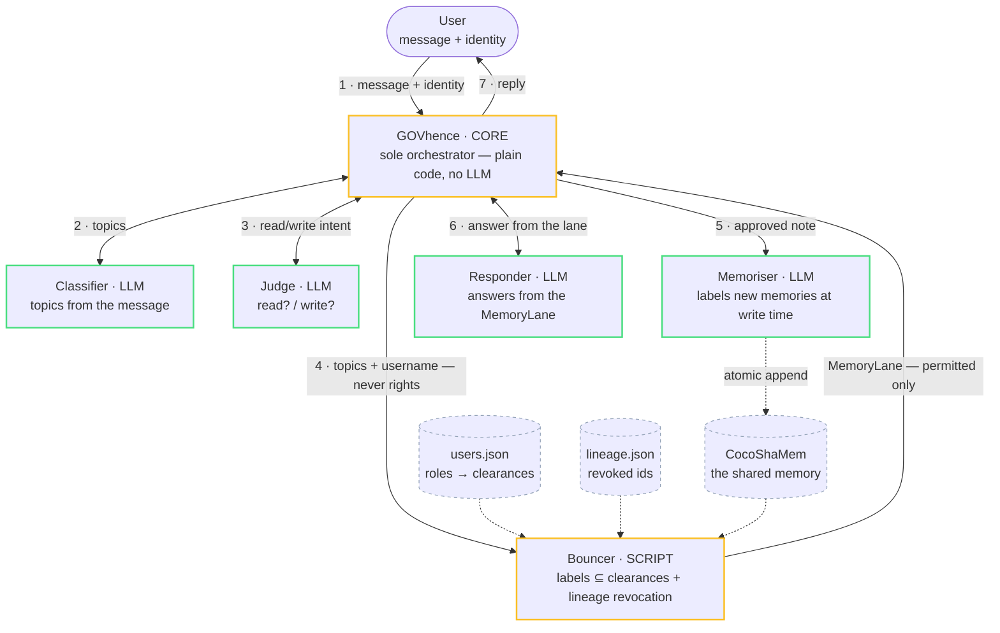

```
    ██████╗  ██████╗ ██╗   ██╗██╗  ██╗███████╗███╗   ██╗ ██████╗███████╗
   ██╔════╝ ██╔═══██╗██║   ██║██║  ██║██╔════╝████╗  ██║██╔════╝██╔════╝
   ██║  ███╗██║   ██║██║   ██║███████║█████╗  ██╔██╗ ██║██║     █████╗
   ██║   ██║██║   ██║╚██╗ ██╔╝██╔══██║██╔══╝  ██║╚██╗██║██║     ██╔══╝
   ╚██████╔╝╚██████╔╝ ╚████╔╝ ██║  ██║███████╗██║ ╚████║╚██████╗███████╗
    ╚═════╝  ╚═════╝   ╚═══╝  ╚═╝  ╚═╝╚══════╝╚═╝  ╚═══╝ ╚═════╝╚══════╝
                ┌─────────────────────────────────────┐
                │   M E M - Ø   ·   zero-trust memory │
                └─────────────────────────────────────┘
        one shared memory · zero leaks · every decision on the record
```

> **Give a whole company of AI agents one shared brain — without any of them seeing what they
> shouldn't.** A deterministic gate decides every access, derived knowledge inherits its sources'
> restrictions, revoking a source kills every derivative, and every decision is logged with its
> reason and its milliseconds. **No AI in the security decision. Ever.**

**Project:** GOVhence · **Team:** team-one · **Members:** [@benjamindacquay](https://github.com/benjamindacquay), [@alexisdacquay](https://github.com/alexisdacquay) · **Track:** UK-AI-Agent-EP5 — Enterprise Memory Governance at Scale

`109 tests passing` · `core = Python stdlib only` · `open-weight models only` · `fail-closed by design`

---

## The problem

```
   Many AI agents.            One shared memory.          A leak waiting to happen.
         o  o  o        ───►        (everything)     ───►       driver's bot reads
         o  o  o                                                the CEO's financials
```

Shared memory makes agents smarter — they stop repeating work and share context. But pool
everything and the logistics driver's bot can read the CEO's financials. The track asks for
memory that is **shared but fenced** — same brain, per-role pages — with **deterministic
enforcement**, **lineage governance for derived memory**, and an **audit trail**.

## Our approach

LLMs can be tricked, jailbroken, or just wrong — so **no LLM ever touches a permission
decision**. LLMs do the *language* work (what is this message about? is it worth storing?);
**plain auditable code** does all the *power* work:

- Every memory **CARRIES `labels`** (security labels: `financials`, `legal`, …). Every user
  **HOLDS `clearances`** via their role ([data/users.json](data/users.json)).
- **The gate is one line of set maths:** served ⇔ `labels ⊆ clearances` — the reader must hold
  **ALL** of a memory's labels. Whitelist-only: no deny lists, no wildcards; a memory with no
  labels is visible to **nobody** (fail-closed, not fail-open).
- `topics` (what a memory is *about*, produced by an LLM) are used **only for relevance** —
  a topic can never grant access, so nothing can be smuggled past the gate via classification.

## Orchestration flow

Hub-and-spoke: **GOVhence**, a deterministic script, is the sole orchestrator — every hop goes
through it, so every hop is recorded. Amber = plain code (holds all the power). Green = LLMs
(never decide access). The bundled **Audit Console** ([GUI/](GUI/)) renders this exact flow live.



---

## See it in 10 seconds

Real output. The auditor asks about a **derived** memory (a briefing summarised from a
financials source + a legal source):

```
$ python src/govhence.py ben-auditor "what's in our risk exposure briefing?"

User -> GOVhence       | ben-auditor: "what's in our risk exposure briefing?"
GOVhence               | profile (from store, never LLM) = {'role': 'auditor', 'department': 'compliance'}
GOVhence <- Classifier | content_tags=['risk', 'exposure', 'briefing']
GOVhence <- Judge      | read=True write=False
GOVhence <- Bouncer    | MemoryLane = ['Risk briefing: Q3 London revenue was 4.2M and the Acme
                       |               contract carries a late-delivery penalty.']
GOVhence -> User       | The risk briefing covers two items: 1. Q3 London revenue was 4.2M. …
```

Now **revoke one of its sources** — one line in [data/lineage.json](data/lineage.json):
`"revoked": ["m-revenue"]` — and ask again, same user, same question:

```
GOVhence <- Bouncer    | MemoryLane = []
GOVhence -> User       | I don't have any information about a risk exposure briefing…

event feed             | DENY · revoked via lineage ('m-briefing') · [withheld]
```

The derivative died with its source — transitively, instantly, no restart, and the refusal is
on the record with its reason. Revert the file and access returns.

**No API key handy?** The security layer is pure code — prove it without any LLM:
`python -m pytest tests/ -q` → **109 passed**.

---

## What it does — the feature lineup

*Everything below is implemented, in [src/](src/), and covered by the 109-test suite.*

### 1 · The Bouncer — no AI in the access decision
One strict subset check decides every item: `labels ⊆ clearances`, exact strings, ALL labels
required. Same input, same answer, every time — and it cannot be talked out of a "no".

### 2 · Fail-closed, everywhere
Unknown user → nothing. Memory with no labels → visible to **nobody**. Malformed config,
memory, lineage or identity → loud `ConfigError`, nothing served. A broken event log never
blocks a decision; a broken *permission* source always does.

### 3 · Topics can't smuggle access
Two vocabularies, never mixed: LLM-produced `topics` = relevance only; `labels`/`clearances` =
access only. Querying with `financials` as a *topic* grants exactly nothing — tested.

### 4 · Lineage — derived memory is governed by its sources
```
  inherit:    labels(derivative)  =  labels(own) ∪ labels(every source)

              m-revenue {financials}        m-contract {legal}
                         └──────────┬──────────────┘
                                    ▼  derived_from
                       m-briefing {financials, legal}     ← carries BOTH constraints

  who sees the briefing?
              exec      holds {…, financials}          ✗ DENY   missing legal
              counsel   holds {…, legal}               ✗ DENY   missing financials
              auditor   holds {…, financials, legal}   ✓ ALLOW  holds every label

  revoke:     lineage.json {"revoked": ["m-revenue"]}
              m-revenue ──► m-briefing ──► (anything derived from it ──► …)
                DENY            DENY                    DENY
              transitive · cycle-safe · "revoked beats permitted" —
              even the auditor loses it, and the store itself is never touched
```
A summary inherits the access constraints of **all** its sources (label union = you must satisfy
every source's restriction), and revoking a source propagates to every derivative
([src/bouncer.py](src/bouncer.py) `revoked_ids`).

### 5 · Governed writes — poisoning defence
The **Judge** decides *if* something is worth storing; the **Memoriser** labels it at write
time from the known vocabulary — then deterministic code enforces the **writer cap**: you can
never plant content **above your own clearance** (a driver cannot inject into the financials
lane). Invalid labels, LLM outage, or a disk failure → the write is **refused**, never stored
mislabelled. Persistence is atomic (write-tmp, then rename).

### 6 · Live ACL sync — no restarts
Clearances are cached in memory with a short TTL: edit [data/users.json](data/users.json) and a
revoked clearance stops working within ~5 seconds, on a **running** system. Credential reads
cost ~0.0003 ms warm — and every one is logged with its duration.

### 7 · Every decision on the record — and a GUI to watch it
Each run appends to an event feed ([data/events.jsonl](data/)): every hop with milliseconds,
every credential check, every per-memory **ALLOW/DENY with its reason**. Denied bodies are
**redacted** (`[withheld]`) — the feed can never become the leak. The **Audit Console**
(`python GUI/serve_gui.py`) graphs the pipeline and streams the Bouncer's decisions live.

### 8 · No silent fallbacks
If the Judge's model is down, GOVhence **refuses the message loudly** — it never quietly
degrades to keyword rules that could mis-govern. Transient empty LLM replies are retried;
persistent failure is an honest error, not a guess.

---

## Run it

```bash
python -m venv .venv && source .venv/bin/activate     # Windows: .venv\Scripts\activate
pip install -r requirements.txt                       # pytest only — the core is stdlib
cp .env.example .env                                  # add your LLM API key(s)

python src/govhence.py bob "where is the best sandwich in London?"   # one governed turn
python src/live_test.py                               # interactive: pick a user, type messages
python -m pytest tests/ -q                            # the 109-test suite (no API key needed)
python GUI/serve_gui.py                               # Audit Console → http://127.0.0.1:8777
```

Try the same question as `ben-staff`, `ben-driver`, `ben-exec`, `ben-legal`, `ben-auditor`
(one user per clearance level) and watch the MemoryLane change.

## Demo

- 🖥️ **Live — zero setup:** `python GUI/serve_gui.py` → http://127.0.0.1:8777. The Audit
  Console renders the recorded event feed ([data/events.jsonl](data/)) — the submission ships
  with real demo runs pre-recorded (including the lineage-revocation DENY), so it displays
  **without any API key**. Run your own turns and watch them stream in live.
- 🎞️ **Deck:** [docs/GOVhence MEM-0 Presentation v2.pptx](docs/GOVhence%20MEM-0%20Presentation%20v2.pptx)
- 📜 The ["See it in 10 seconds"](#see-it-in-10-seconds) transcript above is real output —
  reproducible with the commands in *Run it*.

## Project structure

```
team-one/
├── README.md               you are here
├── src/                    govhence (orchestrator) · bouncer (the gate) · classifier
│                           judge · memoriser · responder · llm · eventlog · live_test
├── data/                   users.json (roles → clearances) · cocoshamem.seed.json (memories)
│                           lineage.json (revocations) · events.jsonl (runtime feed, git-ignored)
├── tests/                  the pytest suite — 109 tests
├── GUI/                    Audit Console (python GUI/serve_gui.py)
└── docs/                   PRD.md · PRD-security.md (threat model) · ROADMAP.md · …
```

## Under the hood

| | |
|---|---|
| **AI in the access decision** | **None.** Pure set maths in plain code — deterministic, auditable. |
| **Stack** | Python 3.13, **stdlib-only core** — `pytest` is the sole dependency. No database: three JSON files. |
| **Models** | **Open-weight only** (GLM-5.2, Mistral) — per-component routing via `.env`, so each role can run a different model. |
| **Tests** | 109 passing — access rules, fail-closed totality, topics-vs-labels, lineage closure, writer cap, atomic persistence, event log redaction. |
| **Hardened against** | prompt injection in messages *and* stored notes, label-smuggling via topics, homoglyph/RTL unicode, malformed config, hostile identities, multi-paragraph payloads. |

## Tech & sponsor APIs used

- **Models / LLMs:** open-weight only — **GLM-5.2** (via Nebius Token Factory and mor.org)
  and **Mistral**. Each pipeline role can run a *different* model: per-component routing via
  `.env` (`CLASSIFIER_LLM_*`, `JUDGE_LLM_*`, …), so any OpenAI-compatible endpoint —
  including sponsor APIs — plugs in with zero code change.
- **Frameworks:** none. Python 3.13 standard library end to end; `pytest` is the only
  dependency. No database — three human-editable JSON files govern everything.
- **Front-end:** React 18 (vendored, no build step) for the Audit Console, served by a
  stdlib loopback-only HTTP server.

## Designed, not yet built

Scoped in [docs/PRD-security.md](docs/PRD-security.md) with the threat model: a tamper-evident
**hash-chained audit log** (append-only, gap-detecting, off-host anchoring) and semantic
retrieval over already-permitted content. The event feed above is the operational precursor.

---

> **Naming:** written **GOVhence MEM-Ø** (the slashed Ø evokes zero-trust); typed `MEM-0` in code.
> The submission folder stays `team-one` per the hackathon's naming rule.
>
> **No secrets committed.** Real keys live only in your local `.env`
> (`.env.example` documents the variables). All demo data is fake.
