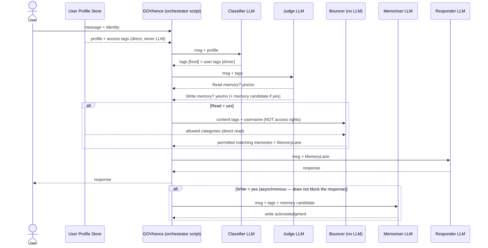
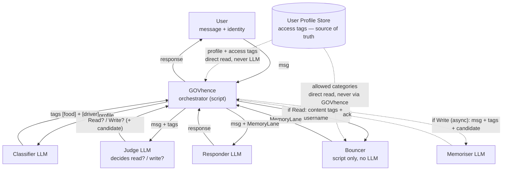

# GOVhence MEM-Ø — Process Spec (authoritative, 2026-07-01)

> **AUTHORITY.** This document is the authoritative process spec as of 2026-07-01. Where it differs from
> [`PRD.md`](PRD.md), **this document wins.** The older `PRD.md` is kept for reference only — some of its
> detail (constraints, data model, roadmap mapping) is still useful, so cross-check it, but do **not**
> treat its *process* steps as authoritative. When in doubt, this file is the decision of record.
>
> **Provenance.** Derived from the owner's 2026-07-01 written spec + hand diagram. The original verbatim
> wording (which framed the Judge as forwarding to the Responder) is preserved in git history
> (commit `346e8eb`); it is superseded here by the **GOVhence-orchestrated** model below.

---

## ⭐ BUILD TARGET #1 — the walking skeleton (top priority)

Build the **whole chain** end-to-end first, with the **simplest possible** components and **NO
security/audit burden** — just to prove the process/logic works. Harden later (snap the real Bouncer +
audit into their steps once the chain runs). This is the hub-and-spoke call sequence — **GOVhence
returns to the centre between every hop**:

```
User
  → GOVhence (orchestrator script)                          receive message + simple profile
      → Classifier (LLM)                    msg + profile  →  tags
  → GOVhence (orchestrator script)
      → Judge (LLM)                         msg + tags  →  read? write? (+ candidate)
  → GOVhence (orchestrator script)
      → Bouncer (script)  and/or  Memoriser (LLM)   read: fetch permitted memories (MemoryLane)
                                                     write: store the candidate
      → Responder (LLM)                     msg + MemoryLane  →  response
  → GOVhence (orchestrator script)
→ User                                       response
```

Everything routes through GOVhence; no component calls another directly. First cut can use trivial
placeholder logic in each LLM role — the goal is a working chain, not smart components.

---

## Roles

| Component | Type | One-line role |
|---|---|---|
| **User Profile Store** | Data (source of truth) | Holds each user's profile + access tags (role, department, RBAC/ACL). The ONLY source of identity/access tags. |
| **GOVhence** | **Script** — sole orchestrator (no LLM) | Receives the message, reads the profile, routes work to every other component, waits where needed, returns the answer. Deterministic control flow — no language understanding; that lives in the LLM roles it calls. Nothing bypasses it. |
| **Classifier** | LLM | Turns `msg + profile` into tags: content tags + profile-derived user tags. Reuses existing tags. |
| **Judge** | LLM — **decision function** | Given `msg + tags`, decides *Read memory?* and *Write memory?* (and, if writing, produces a memory candidate). Decides only; it does not route. |
| **Bouncer** | **Script, NO LLM** | Strict tag matcher + RBAC/ACL + access inheritance. Returns permitted matching memories (**MemoryLane**). The sole access gate. |
| **Memoriser** | LLM | Writes an approved memory candidate to the store, reusing existing tags. Returns an acknowledgment. |
| **Responder** | LLM | Given `msg + MemoryLane`, produces the final response. |

---

## Process (normative — GOVhence-orchestrated)

**GOVhence is the sole orchestrator.** Every other component receives from and returns to GOVhence;
none of them call each other directly. The Judge *decides*; GOVhence *acts* on those decisions.

### Read / response path — synchronous (the user waits for this)
1. **User → GOVhence:** a message + identity (name, profile = role + department).
2. **GOVhence reads the Profile Store** for the user's profile (name, role, department) — used as
   context and passed to the Classifier. GOVhence does **not** hand access rights onward; the **Bouncer**
   reads the user's allowed categories itself (step 5). These identity tags are **never** LLM-produced.
3. **GOVhence → Classifier** (`msg + profile`). The Classifier returns **content tags** (e.g. `[food]`)
   and attaches the **profile-derived user tags** (e.g. `[driver]`), reusing existing tags (hygiene).
4. **GOVhence → Judge** (`msg + tags`). The Judge is a pure decision function and returns to GOVhence:
   - **Read memory?** yes/no — the first gate: *"is this message worth checking memory at all?"*
     (a bare `"Hi"` → no).
   - **Write memory?** yes/no — and if yes, a **memory candidate** (the content it deems worth storing).
5. **If Read = yes → GOVhence → Bouncer** passing **only the content tags + the username** — never the
   access rights. The **Bouncer is script-only (no LLM)**: it reads the user's allowed categories
   **directly from the Profile Store (`users.json`)** given the username, matches content tags for
   relevance, and returns only the **permitted** memories = **MemoryLane**. Access is never supplied by
   GOVhence/an LLM, so it cannot be smuggled via tags. **GOVhence waits** for the Bouncer.
   **If Read = no →** no retrieval; MemoryLane is empty.
6. **GOVhence → Responder** (`msg + MemoryLane`). The Responder returns the response.
7. **GOVhence → User:** the response.

### Write path — asynchronous (must NOT delay steps 6–7)
8. **If Write = yes** (from step 4): asynchronously, **GOVhence → Memoriser**
   (`msg + tags + memory candidate`).
9. The **Memoriser writes** the memory — **reusing existing tags** to avoid duplication, with **no LLM
   expansion** (authenticity comes from the original message) — and returns an **acknowledgment** to
   GOVhence. *(Roadmap: an optional second verification pass → [`ROADMAP.md`](ROADMAP.md).)*

> The Judge assesses **both** read- and write-worthiness for the same `msg + tags`. GOVhence uses the
> read decision **synchronously** (steps 5–7) and executes the write decision **asynchronously**
> (steps 8–9), so memory writes never slow the user's answer.

---

## Data-flow diagrams

### Sequence


### Flowchart


---

## Component I/O

| Component | Receives (from GOVhence, unless noted) | Returns to GOVhence / does |
|---|---|---|
| **User Profile Store** | — | Provides profile + access tags **directly** (never LLM-guessed). |
| **GOVhence** | user msg + identity; component outputs | Routes to Classifier → Judge → (Bouncer) → Responder; async → Memoriser; returns response to user. |
| **Classifier LLM** | `msg + profile` | Content tags + profile-derived user tags (e.g. `[food]`, `[driver]`); reuses existing tags. |
| **Judge LLM** | `msg + tags` | Read? yes/no; Write? yes/no; memory candidate if Write = yes. |
| **Bouncer** (no LLM) | content tags + **username** (reads access from `users.json` itself) | Permitted matching memories = **MemoryLane** (strict, fail-closed). |
| **Memoriser LLM** | `msg + tags + memory candidate` | Writes memory (reuse tags, no expansion); returns acknowledgment. |
| **Responder LLM** | `msg + MemoryLane` | The final response. |
| **MemoryLane** | (payload) matching memories from the Bouncer | Passed by GOVhence to the Responder. |

---

## Invariants

- **Profile/access tags are never LLM-derived, and the Bouncer reads them itself.** Role, department,
  and RBAC/ACL tags **always** come directly from the User Profile Store. No LLM (Classifier, Judge,
  Memoriser, Responder, or GOVhence) invents, infers, or guesses them — and crucially **GOVhence does
  not relay access rights to the Bouncer**: the Bouncer reads the user's allowed categories directly
  from `users.json`, given only the username. So access cannot be smuggled via content tags and no LLM
  sits in the access-trust path. *(This is the dotted line in the diagram — identity-integrity /
  anti-injection.)*
- **No LLM in the access decision.** The **Bouncer** is the sole access gate: script-only, deterministic,
  fail-closed. LLMs classify / judge / memorise / respond — they never *gate* access.
- **Open-weight models only** (Llama/Qwen/Mistral via BasedAPIs) — no closed models anywhere in the loop.
- **Audit — a legal record; no log → no access.** Every retrieval decision (ALLOW + DENY) is logged;
  append-only, tamper-evident, complete. A logging failure **fails closed** — access is refused rather
  than granted unlogged.
- **Derived-memory access inheritance.** A memory derived from others (summary / note / embedding) is
  tagged the **most-restrictive** access category across itself + all its sources, resolved at WRITE
  time by trusted code (no LLM); the Bouncer then enforces that tag. So a derivative can never leak what
  its sources protected. *(The R3 engineering task tracks the implementation.)*
- **Async memory-write** — the write path (Memoriser) runs asynchronously and must **not** block the
  response. Reading memory is the first-stage step *before* the Responder.
- **Tag hygiene** — reuse existing tags; single-word or hyphenated; no near-duplicate proliferation
  (`location` vs `Location`, `weekend` vs `week-end`).
- **Fail-closed / RBAC-ACL** — untagged or ambiguous content denies; every read scoped to the user's
  permitted set.
- **Latency** — target sub-200ms P99 for permission checks.
- **Portability** — runs identically on Windows + macOS.

---

## Naming

- **Bouncer** — the memory retriever: a strict, **script-only (no LLM)** tag matcher that also enforces
  RBAC/ACL and user access inheritance. Name of record (the code already uses `bouncer`).
- *"DeterminExtractor"* — **deprecated alias** for the Bouncer used in the older `PRD.md`. Same
  component; use **Bouncer** going forward.

---

## Superseded by this document (what changed vs PRD.md)

1. **GOVhence is the sole orchestrator.** The Judge is a **pure decision function** (returns Read?/Write?
   + candidate); GOVhence calls the Bouncer/Memoriser/Responder and waits. (Old `PRD.md` was vaguer;
   the owner's earlier verbatim text wrongly had the *Judge* forward to the Responder — corrected here.)
2. **Read is gated by the Judge.** The Judge's first gate is *"is this worth checking memory at all?"* —
   a `"Hi"` skips retrieval and goes straight to the Responder. (Old `PRD.md` step 6 said *every* message
   is a retrieval candidate — superseded.)
3. **Profile/access tags come only from the Profile Store**, never an LLM (new explicit invariant).
4. **GOVhence calls the Bouncer and waits** for its response before calling the Responder.
5. **Judge owns write-candidate selection**; the Memoriser is the leaner writer (reuse tags, no
   expansion). A second verification pass is roadmap, not in scope.

---

## Roadmap pointer

- Memoriser **second run of verifications** (extra precision/security pass before committing a memory) →
  [`ROADMAP.md`](ROADMAP.md) (not in scope for this spec).
